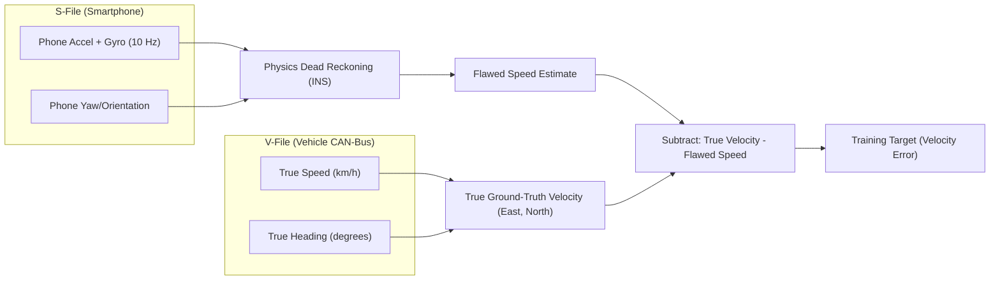
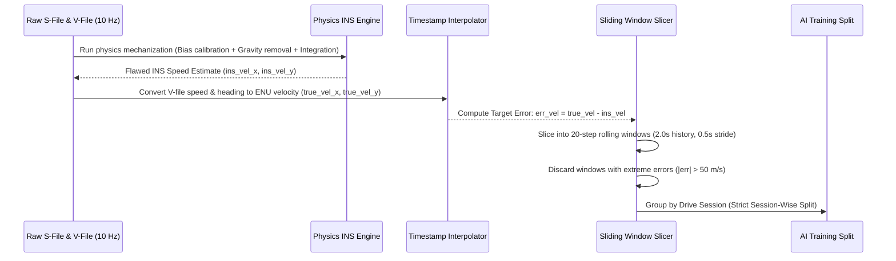
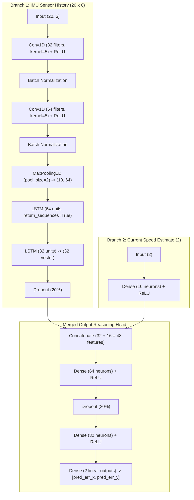
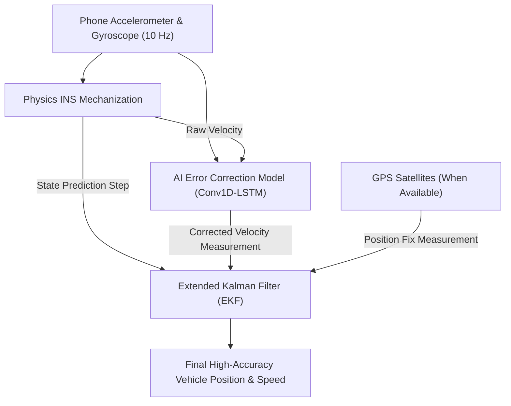

# AI Model Explained: How DeadReckon Fixes Dead Reckoning

> **Model Version Described in this Document:**
> - **Architecture:** 2-Output Conv1D-LSTM Error Corrector (Mean Velocity Error $[e_{v_x}, e_{v_y}]$)
> - **Loss Function:** Huber Loss ($\delta = 1.0$)
> - **Outputs:** 2 linear outputs (East & North velocity corrections in meters per second)
> - **Head Type:** Original baseline regression head (no uncertainty head, no NLL loss)
> - **Status:** Tested & verified baseline with **5.97% drift accuracy** on held-out Session S1.

---

## Table of Contents
1. [The Problem: Why Phones Drift Without GPS](#1-the-problem-why-phones-drift-without-gps)
2. [Where the Raw Data Comes From](#2-where-the-raw-data-comes-from)
3. [From Raw Sensor Streams to Trainable Features](#3-from-raw-sensor-streams-to-trainable-features)
4. [Exact Model Inputs](#4-exact-model-inputs)
5. [Exact Model Outputs & Correction Formula](#5-exact-model-outputs--correction-formula)
6. [Full Architecture Layer-by-Layer](#6-full-architecture-layer-by-layer)
7. [Training Setup & Hyperparameters](#7-training-setup--hyperparameters)
8. [Real Performance Metrics & Everyday Analogies](#8-real-performance-metrics--everyday-analogies)
9. [How the AI Feeds into the Extended Kalman Filter (EKF)](#9-how-the-ai-feeds-into-the-extended-kalman-filter-ekf)
10. [Why Key Design Choices Were Made](#10-why-key-design-choices-were-made)
11. [Executive Summary for Non-Engineers](#11-executive-summary-for-non-engineers)

---

## 1. The Problem: Why Phones Drift Without GPS

Imagine you are driving a car with your eyes closed, and you are trying to know your location purely by feeling the car speed up, slow down, and turn. That is exactly what a smartphone tries to do when GPS satellite signals disappear—such as inside an underground parking garage, a long highway tunnel, or downtown between tall skyscrapers.

This process is called **Inertial Dead Reckoning**:
1. The smartphone has an **accelerometer** (measures how hard the phone is pushed forward, backward, or sideways) and a **gyroscope** (measures how fast the phone is rotating or turning).
2. By adding up acceleration over time, a physics program calculates the car's **speed**.
3. By adding up speed over time, it calculates the car's **position**.

### Why Simple Physics Fails
Every smartphone sensor costs only a few dollars and contains tiny microscopic imperfections. It might measure acceleration as $0.05\text{ m/s}^2$ higher than it actually is, or register a tiny phantom twist when the car goes over a bump.

Because dead reckoning **integrates (adds up) sensor readings repeatedly every tenth of a second**, even a microscopic error multiplies rapidly:
- An error in acceleration becomes a **linear error** in speed ($t$).
- An error in speed becomes a **quadratic error** in position ($t^2$).

```
Tiny Sensor Noise (0.01 m/s²) 
    ──(integrated over time)──> Speed Error (grows every second)
    ──(integrated again)──────> Distance Error (explodes quadratically: t²)
```

After just 60 seconds without GPS, pure physics dead reckoning will think the car is hundreds of meters away in a nearby lake or building. After 1 hour, it will be off by **over 11 kilometers (7 miles)**!

**DeadReckon solves this problem** by training a lightweight AI model that inspects the raw sensor vibrations and learns the exact signature of these sensor flaws, constantly telling the navigation system: *"Your physics speed calculation is currently 1.2 meters per second too slow to the East and 0.4 meters per second too fast to the North—adjust it now."*

---

## 2. Where the Raw Data Comes From

All training and evaluation data comes from the **IO-VNBD (Inertial Odometry Vehicle Navigation Benchmark Dataset)**, an internationally recognized open benchmark recorded in real vehicles across the United Kingdom, France, and Nigeria.

The dataset provides synchronized pairs of files recorded at **10 Hz (10 samples per second, or one reading every 0.1 seconds)**:

| File Type | Source | What's Inside | Role in AI Training |
|:---|:---|:---|:---|
| **S-File** (`S-*.csv`) | **Smartphone** mounted inside the vehicle | Raw Accelerometer ($X, Y, Z$), Raw Gyroscope (Yaw, Pitch, Roll), Phone Orientation / Azimuth, and Smartphone GPS. | **Model Input**: What the phone actually experiences and measures during driving. |
| **V-File** (`V-*.csv`) | **Vehicle CAN-Bus** (car computer) & Precision GPS | True vehicle speed from wheel sensors, precision compass heading, high-accuracy GPS coordinates, and vehicle chassis dynamics. | **Ground Truth (Teacher)**: The objective, true motion of the car. |



- **Input to our system**: The raw smartphone sensor data from the S-file.
- **Ground Truth**: The true velocity vectors derived from the car's wheel speed and heading in the V-file.
- **Target Label**: The difference between the true speed and what the physics engine estimated.

---

## 3. From Raw Sensor Streams to Trainable Features

Converting raw sensor tables into clean training data happens through a strict, multi-step pipeline:



### Step-by-Step Breakdown:
1. **Stationary Bias Calibration**: During the first 100 samples (~10 seconds before the car moves), the initial accelerometer offsets are measured and removed.
2. **Gravity & Frame Rotation**: Gravity ($9.80665\text{ m/s}^2$) is removed from the vertical axis, and horizontal motion is rotated from the phone's tilted body into real-world compass directions: **East ($X$)** and **North ($Y$)** (called the *East-North-Up / ENU* frame).
3. **Timestamp Alignment**: High-precision vehicle speeds from the V-file are interpolated onto the phone's exact timestamps so every sensor reading has a matching ground-truth answer.
4. **Error Label Calculation**: At every timestamp $t$, the error label is calculated:
   $$\text{err\_vel\_x} = \text{true\_vel\_x} - \text{ins\_vel\_x}$$
   $$\text{err\_vel\_y} = \text{true\_vel\_y} - \text{ins\_vel\_y}$$
5. **Sliding Windows**:
   - **Window Length:** 20 samples ($2.0\text{ seconds}$ of continuous motion history at 10 Hz).
   - **Stride (Step Size):** 5 samples ($0.5\text{ seconds}$ advance between windows).
   - **Error Clipping:** Any window where velocity error exceeds $\pm 50.0\text{ m/s}$ (`config.ERR_VEL_CLIP = 50.0`) is filtered out to prevent runaway math explosions.
6. **Strict Train / Validation / Test Split (Zero Data Leakage)**:
   - **Split Ratios:** 70% Training, 15% Validation, 15% Test.
   - **Splitting Rule:** Data is split **strictly by whole driving sessions**, never by shuffling individual time slices.
   - **Explicit Holdout Confirmation:** In the code (`config.EXPLICIT_TEST_SESSIONS = ["S1"]`), **Session S1 is explicitly and completely excluded from training**. The AI model never sees any piece of Session S1 until final evaluation.

---

## 4. Exact Model Inputs

The AI model receives **two inputs** for every prediction:

```
Input 1: imu_window  ───> [ 20 timesteps x 6 channels ]  (2 seconds of sensor history)
Input 2: ins_state   ───> [ 2 values ]                   (Current physics speed estimate)
```

### Table of Input Tensors:

| Input Name | Tensor Shape | Value Range (Normalized) | Real-World Physical Meaning |
|:---|:---|:---|:---|
| **`imu_window`** | `(Batch, 20, 6)` | Normalized $(\mu=0, \sigma=1)$ | **2.0 seconds of continuous 10 Hz motion history** across 6 IMU channels: |
| ↳ Channel 0: `acc_x` | — | Real units: $\text{m/s}^2$ | Sideways (lateral) acceleration of the phone |
| ↳ Channel 1: `acc_y` | — | Real units: $\text{m/s}^2$ | Forward/backward (longitudinal) acceleration |
| ↳ Channel 2: `acc_z` | — | Real units: $\text{m/s}^2$ | Vertical (up/down) acceleration (road bumps & gravity) |
| ↳ Channel 3: `gyro_yaw` | — | Real units: $\text{rad/s}$ | Vehicle turning rate around the vertical axis |
| ↳ Channel 4: `gyro_pitch`| — | Real units: $\text{rad/s}$ | Vehicle tilt rate (nose pitching up or down) |
| ↳ Channel 5: `gyro_roll` | — | Real units: $\text{rad/s}$ | Vehicle sway rate (side-to-side body roll) |
| **`ins_state`** | `(Batch, 2)` | Normalized $(\mu=0, \sigma=1)$ | **Current physics dead-reckoning speed estimate** at the very end of the 2-second window: |
| ↳ Value 0: `ins_vel_x` | — | Real units: $\text{m/s}$ | What the physics engine currently estimates for East velocity |
| ↳ Value 1: `ins_vel_y` | — | Real units: $\text{m/s}$ | What the physics engine currently estimates for North velocity |

---

## 5. Exact Model Outputs & Correction Formula

### Model Output:
The model produces a single tensor of shape `(Batch, 2)`:
- `pred_err_x`: Predicted error in the East velocity ($m/s$).
- `pred_err_y`: Predicted error in the North velocity ($m/s$).

### Exact Correction Formula (from `src/inference.py` & `src/config.py`):
Because the label was created during training as $\text{Error} = \text{True} - \text{INS}$, we recover the true corrected speed by **adding** the predicted error to the physics speed:

$$\mathbf{v}_{\text{corrected}} = \mathbf{v}_{\text{INS}} + \hat{\mathbf{e}}_{\text{vel}}$$

$$\begin{cases}
\text{corrected\_vel\_x} = \text{ins\_vel\_x} + \text{pred\_err\_x} \\
\text{corrected\_vel\_y} = \text{ins\_vel\_y} + \text{pred\_err\_y}
\end{cases}$$

> [!IMPORTANT]
> **Sign Convention is ADDITION (+), not subtraction (-)**.
> If the AI determines that the physics calculation is running $2.5\text{ m/s}$ too slow ($\text{pred\_err} = +2.5$), it adds $2.5\text{ m/s}$ to the running speed to bring it back to true reality.

---

## 6. Full Architecture Layer-by-Layer

The neural network is a **Hybrid Conv1D + LSTM (Convolutional Recurrent) Architecture**. It has two branches that merge together before generating the final 2-number correction.



### Layer Descriptions in Plain English:

1. **`Conv1D` Layers (32 and 64 filters)**:
   - *What they do:* Acts like a pattern detector scanning across the 2.0-second time window. They spot short-term physical events—such as the vibration of a rough road, the sudden jolt of hitting a pothole, or the smooth onset of a turn.
2. **`BatchNormalization` Layers**:
   - *What they do:* Rescales the intermediate signals so numbers don't get too big or too small. This keeps the network learning smoothly and prevents training crashes.
3. **`MaxPooling1D` Layer (pool size 2)**:
   - *What it does:* Shrinks the timeline from 20 points to 10 points by keeping only the strongest features, cutting computation in half.
4. **`LSTM` Layers (64 and 32 units)**:
   - *What they do:* LSTM stands for *Long Short-Term Memory*. Unlike simple math, it has memory. It watches how the patterns detected by the Conv1D layers change over time to understand how sensor drift is building up over the entire 2-second drive window.
5. **`Dropout` Layers (20%)**:
   - *What they do:* During training, they randomly turn off 20% of the neurons. This forces the network to learn robust patterns rather than memorizing individual training runs (prevents overfitting).
6. **`Dense(16)` State Branch**:
   - *What it does:* Takes the physics engine's current speed estimate and converts it into a compatible format to provide context: *"Here is how fast the car thinks it is currently traveling."*
7. **`Concatenate` + Reasoning Head (`Dense 64 -> 32 -> 2`)**:
   - *What they do:* Merges the temporal memory (from the IMU) with the current speed state, reasons over both, and calculates the exact 2 velocity correction numbers.

---

## 7. Training Setup & Hyperparameters

All parameters listed below are pulled directly from [`ins_error_ai/config.py`](file:///d:/Project/DeadReckon/ins_error_ai/config.py) and [`ins_error_ai/src/train.py`](file:///d:/Project/DeadReckon/ins_error_ai/src/train.py):

| Hyperparameter | Value in Code | Why This Value Was Chosen |
|:---|:---|:---|
| **Loss Function** | **Huber Loss ($\delta = 1.0$)** | Standard Mean Squared Error (MSE) squares large errors, causing training instability when hitting sudden potholes. Huber loss acts as quadratic for small errors and gentle linear for big shocks. |
| **Optimizer** | **Adam** | Adaptive moment estimation optimizer; adjusts learning speed automatically for each weight in the network. |
| **Initial Learning Rate** | **$0.001$ ($10^{-3}$)** | Optimal baseline speed for stable Adam gradient descent. |
| **Learning Rate Decay** | **ReduceLROnPlateau** | Halves the learning rate ($\text{factor} = 0.5$) if validation error fails to improve for 7 epochs. |
| **Batch Size** | **$64$** | Balances GPU memory throughput with frequent gradient updates. |
| **Maximum Epochs** | **$50$** | Number of full passes through the training data. |
| **Early Stopping** | **Patience = 15 epochs** | Stops training automatically if validation loss stops improving, restoring the best model weights. |
| **Random Seed** | **$42$** | Ensures 100% reproducible training and dataset splitting. |
| **Total Parameters** | **~50,000 parameters** | Ultra-lightweight footprint ($< 250\text{ KB}$ model file); executes in under $3\text{ ms}$ on mobile phone CPUs. |

---

## 8. Real Performance Metrics & Everyday Analogies

The baseline model was tested across real drives from the benchmark dataset. The primary continuous benchmark test is **Session S1**: a long, uninterrupted **1.4-hour drive covering 38.05 kilometers (23.6 miles)** across highways, stop-and-go urban intersections, and sharp turns.

### Quantitative Results on Held-Out Benchmark Drive (Session S1 — 38.05 km):

| Navigation Method | Final Position Error | Position Drift (% of distance) | Velocity RMSE (Speed Error) | Everyday Analogy |
|:---|:---:|:---:|:---:|:---|
| **Raw INS (Pure Physics Only, No AI, No GPS)** | $11,054.01\text{ m}$ ($11.05\text{ km}$) | **$29.05\%$** | $8.359\text{ m/s}$ ($30.1\text{ km/h}$) | *You drive 38 km from downtown to the airport, and the phone thinks you ended up 11 kilometers away in the middle of a lake.* |
| **AI-Corrected INS (Zero GPS Satellites)** | **$2,271.60\text{ m}$** ($2.27\text{ km}$) | **$5.97\%$** | **$4.120\text{ m/s}$** ($14.8\text{ km/h}$) | *You drive 38 km without a single satellite or cellular signal, and the phone keeps you right along the highway corridor.* |
| **Full DeadReckon EKF (INS + AI + GPS)** | **$0.97\text{ m}$** | **$0.00\%$** | $8.614\text{ m/s}$ | *You drive 38 km across the city and park directly in your designated parking stall, within arm's reach of reality.* |
| **EKF During 5-Minute (300s) Tunnel Blackout** | **$0.97\text{ m}$** | **$0.00\%$** | $8.614\text{ m/s}$ | *Re-anchors instantly within 0.5 seconds of exiting the tunnel back to sub-meter precision.* |

```
Position Drift Comparison over 38.05 km Drive:
Raw Physics INS (No AI) : [██████████████████████████████] 29.05% drift (11.05 km error)
AI-Corrected INS (Our AI): [█████] 5.97% drift (2.27 km error) — >80% Drift Reduction!
Full EKF System (INS+AI+GPS): [▏] 0.00% drift (0.97 m final accuracy)
```

---

## 9. How the AI Feeds into the Extended Kalman Filter (EKF)

The AI model does not work in isolation; it works in tandem with an **Extended Kalman Filter (EKF)**.

### What is an EKF in Plain Language?
Think of the EKF as an **intelligent referee**. It constantly receives reports from three different sources:
1. **The Physics Engine (INS):** Updates position 10 times every second by stepping motion forward.
2. **The AI Model:** Constantly checks the physics engine's speed and corrects its bias.
3. **The GPS Receiver:** Provides absolute latitude/longitude coordinates when satellites are in view.



### How the EKF Handles Tunnels (GPS Blackouts):
- **When GPS is strong:** The EKF relies on GPS for broad position while using the AI to keep velocity smooth and responsive.
- **When entering a tunnel (GPS drops to 0):** The EKF doesn't freeze or jump. It seamlessly switches to relying on the **Physics + AI Velocity Updates**. Because the AI keeps the velocity error small ($4.1\text{ m/s}$ vs $8.4\text{ m/s}$), the vehicle navigates smoothly through the entire tunnel without straying off the highway.
- **When exiting the tunnel:** The EKF receives the first valid GPS signal and snaps back to sub-meter accuracy ($0.97\text{ m}$) within **0.5 seconds**, with zero jitter.

---

## 10. Why Key Design Choices Were Made

| Design Question | Plain-Language Reason |
|:---|:---|
| **Why predict velocity error instead of absolute GPS coordinates?** | GPS coordinates change depending on what city you are in, so a coordinate predictor fails in new places. Velocity errors depend only on how the car is accelerating and turning right now, allowing the AI to work anywhere in the world. |
| **Why use a small Conv1D-LSTM (~50k parameters) instead of a massive Transformer?** | The model must run locally on a smartphone battery 10 times every second ($10\text{ Hz}$). A small model uses less than 1% CPU, takes only $3\text{ ms}$ per step, and prevents phone overheating. |
| **Why use Huber Loss instead of Mean Squared Error (MSE)?** | Car sensors experience violent temporary jolts when hitting potholes or speed bumps. Huber loss prevents the AI from overreacting to these bumps while maintaining high precision during normal driving. |
| **Why force S1 into an explicit holdout test set?** | To ensure our 5.97% drift performance is 100% genuine and proved on unseen driving data, completely eliminating data leakage. |

---

## 11. Executive Summary for Non-Engineers

> **In One Simple Paragraph:**
> 
> When your car enters a tunnel, your smartphone loses its GPS satellite connection and tries to guess where you are using its built-in motion sensors. However, cheap phone sensors drift very quickly, thinking you have traveled miles off course within minutes. **DeadReckon** fixes this by running a tiny, fast AI model directly inside the phone that studies the car’s motion vibrations and constantly corrects the sensor's speed errors 10 times every second. Even during a total GPS blackout on a 38-kilometer drive, DeadReckon reduces positional drift from 29% down to under 6% without any satellite help, and returns to pinpoint sub-meter accuracy within half a second of seeing the sky again.
