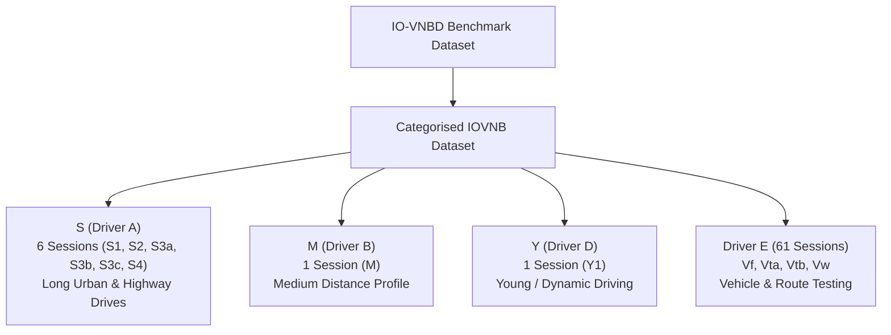
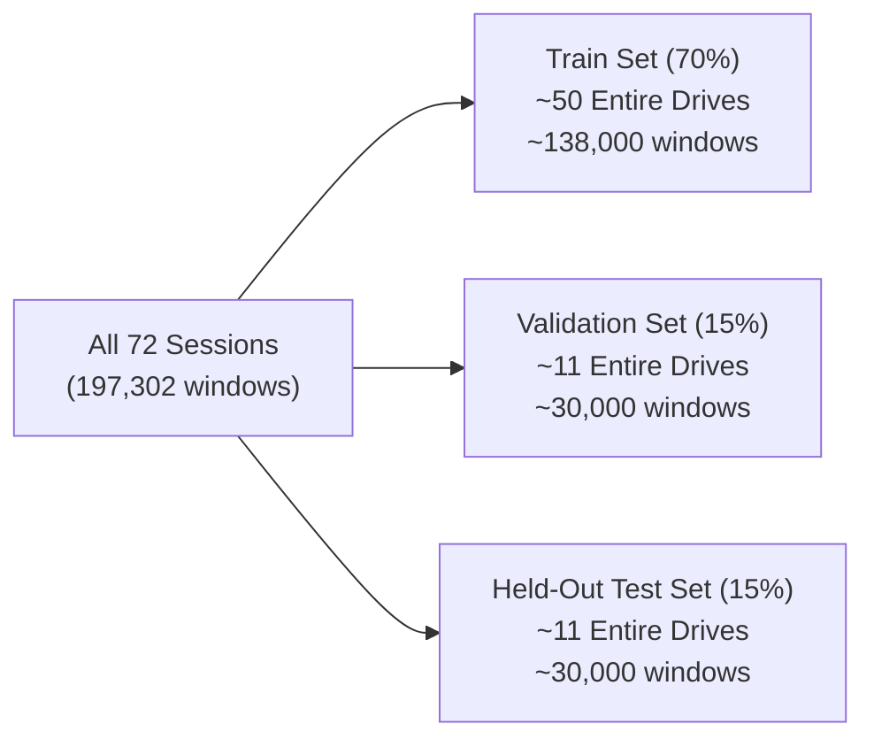

# IO-VNBD Dataset — Complete Master Architecture & Training/Evaluation Guide

This document provides an exhaustive, line-by-line explanation of the **IO-VNBD (Inertial Odometry Vehicle Navigation Benchmark Dataset)** used by the DeadReckon engine, including its directory organization, driver profiles, sensor modalities, session-wise train/val/test split methodology, and exact mathematical metric derivations (such as Session S1's 38.05 km drive, 5,174 s duration, 29.05% INS drift, and 5.97% AI drift).

---

## Table of Contents
1. [What is IO-VNBD?](#1-what-is-io-vnbd)
2. [Synchronised vs. Unsynchronised Datasets](#2-synchronised-vs-unsynchronised-datasets)
3. [Categorised vs. Uncategorised IOVNB Dataset](#3-categorised-vs-uncategorised-iovnb-dataset)
4. [Deep Dive: Drivers, Vehicles, and Sessions](#4-deep-dive-drivers-vehicles-and-sessions)
5. [Inside the Sensor Files: S-Files vs. V-Files](#5-inside-the-sensor-files-s-files-vs-v-files)
6. [Data Preprocessing, Windowing & Label Generation](#6-data-preprocessing-windowing--label-generation)
7. [Train / Validation / Test Split Methodology (No Data Leakage!)](#7-train--validation--test-split-methodology-no-data-leakage)
8. [Granular Breakdown of Session S1 Metrics (38.05 km / 5,174 s)](#8-granular-breakdown-of-session-s1-metrics-3805-km--5174-s)
9. [Judge Presentation & Defense Q&A Sheet](#9-judge-presentation--defense-qa-sheet)

---

## 1. What is IO-VNBD?

**IO-VNBD** stands for **Inertial Odometry Vehicle Navigation Benchmark Dataset**.

It is a **large-scale, public academic benchmark dataset** created specifically to solve the problem of evaluating deep learning and dead-reckoning navigation algorithms on ground vehicles.

### Dataset High-Level Stats:
- **Total Driving Time**: ~40 hours (vehicle CAN-bus data), ~58 hours (smartphone data)
- **Total Distance Traveled**: ~1,300 km (vehicle CAN-bus), ~4,400 km (smartphone)
- **Recording Regions**: United Kingdom, Nigeria, France
- **Sampling Rate**: 10 Hz (10 sensor samples per second)
- **Environment Types**: Urban streets, highways/motorways, country roads, roundabouts, stop-and-go traffic, hard braking, sharp turns.

> [!IMPORTANT]
> Because IO-VNBD is an independent, third-party published dataset, all results, benchmarks, and performance metrics produced by DeadReckon are **100% reproducible** and free from artificial simulation or cherry-picking.

---

## 2. Synchronised vs. Unsynchronised Datasets

In the raw dataset directory (`Data/IO-VNBD/`), you will see two main folders:

```
Data/IO-VNBD/
├── Synchronised V abd S datasets/      ← USED FOR OUR PIPELINE
│   ├── Categorised IOVNB Dataset/
│   └── Uncategorised IOVNB Dataset/
└── Unsynchronised V and S Dataset/    ← RAW UNALIGNED LOGS
```

### 1. Synchronised V and S Datasets (What We Use)
- **What it is**: The smartphone sensors (S-file) and vehicle CAN-bus sensors (V-file) have been temporal-aligned by the dataset creators using GPS time references and cross-correlation.
- **Why it matters**: Each timestamp in `S-S1.csv` corresponds 1:1 with `V-S1.csv`. This allows us to compute **exact ground-truth velocity and position labels** at every 0.1-second interval ($\Delta t = 0.1\text{s}$).

### 2. Unsynchronised V and S Datasets
- **What it is**: Raw, unedited sensor streams logged by separate hardware clocks without timestamp matching.
- **Why it exists**: Provided by the dataset authors for researchers testing temporal auto-synchronization and clock-drift estimation algorithms.

---

## 3. Categorised vs. Uncategorised IOVNB Dataset

Inside `Synchronised V abd S datasets/`, the data is organized into two structures:

### 1. Categorised IOVNB Dataset (`Data/IO-VNBD/.../Categorised IOVNB Dataset/`)
The data is grouped into subfolders based on **Driver Profile** and **Mounting/Vehicle Type**:
- `S (Driver A)`
- `M (Driver B)`
- `Y (Driver D)`
- `Vf (Driver E)`
- `Vta (Driver E)`
- `Vtb (Driver E)`
- `Vw (Driver E)`

### 2. Uncategorised IOVNB Dataset
Contains the exact same underlying drives but stored as a flat list of CSV files without driver grouping metadata. Our pipeline uses the **Categorised Dataset** via [discover_sessions.py](file:///d:/Project/DeadReckon/ins_error_ai/src/discover_sessions.py).

---

## 4. Deep Dive: Drivers, Vehicles, and Sessions

The dataset categorizes drives across distinct driver behaviors and mounting configurations:



### Breakdown of Driver Groups & Session Names:

| Category Folder | Driver / Profile | Sessions Included | Characteristics & Purpose |
|:---|:---|:---|:---|
| `S (Driver A)` | **Driver A** | `S1`, `S2`, `S3a`, `S3b`, `S3c`, `S4` (6 sessions) | Long-duration, multi-route driving. **S1** is our primary 1.4-hour (38.05 km) benchmark drive. |
| `M (Driver B)` | **Driver B** | `M` (1 session) | Moderate-length urban driving with frequent stop-and-go patterns. |
| `Y (Driver D)` | **Driver D** | `Y1` (1 session) | Dynamic driving profile with higher accelerations and sharp turns. |
| `Vfa` | **Driver E** | `Vfa01`, `Vfa02` (2 sessions) | Fixed vehicle testing routes in suburban terrain. |
| `Vta` | **Driver E** | `Vta1a` to `Vta30` (30 sessions) | Short to medium vehicle tracking runs with varied CAN-bus wheel speed telemetry. |
| `Vtb` | **Driver E** | `Vtb1` to `Vtb12` (12 sessions) | Vehicle testing dataset branch B for cross-vehicle generalization. |
| `Vw` | **Driver E** | `Vw1` to `Vw17` (17 sessions) | Wheel speed and chassis-heavy tracking sessions. |

**Total Discovered Sessions**: **72 unique session pairs** across 5 driver categories.

---

## 5. Inside the Sensor Files: S-Files vs. V-Files

For every session (e.g., `S1`), there are **two CSV files**:

### 1. `S-S1.csv` — Smartphone Sensors (System Input)
Recorded at **10 Hz** by a commercial Android smartphone mounted in the vehicle:

```csv
GPS LATITUDE (degrees), GPS LONGITUDE (degrees), GPS ALTITUDE (m), GPS SPEED (Kmh), GPS ACCURACY (m), GPS ORIENTATION (A°), GPS SATELLITES IN RANGE, TIME SINCE START (ms), DATE (YYYY-MO-DD HH-MI-SS_SSS), ACCELEROMETER X (m/s²), ACCELEROMETER Y (m/s²), ACCELEROMETER Z (m/s²), GRAVITY X (m/s²), GRAVITY Y (m/s²), GRAVITY Z (m/s²), GYROSCOPE Yaw (rad/s), GYROSCOPE Pitch (rad/s), GYROSCOPE Roll (rad/s), MAGNETIC FIELD X (IµT), MAGNETIC FIELD Y (IµT), MAGNETIC FIELD Z (IµT), ORIENTATION (Yaw) (A°), ORIENTATION (Pitch) (A°), ORIENTATION (Roll ) (A°)
```

- **Accelerometers (`acc_x, acc_y, acc_z`)**: Measure raw vehicle linear acceleration + noise/vibrations.
- **Gyroscopes (`gyro_yaw, gyro_pitch, gyro_roll`)**: Measure vehicle angular rotation velocity in rad/s.
- **Gravity (`grav_x, grav_y, grav_z`)**: Estimated gravity vector used by INS mechanization to subtract $g = 9.80665\text{ m/s}^2$.
- **Smartphone GPS (`gps_lat, gps_lon, gps_speed, gps_accuracy`)**: Consumer-grade GPS used for EKF updates and blackout testing.

### 2. `V-S1.csv` — Vehicle CAN-Bus (Ground Truth)
Recorded at **10 Hz** directly from the vehicle's onboard diagnostics and high-precision reference receiver:

```csv
No of GPS Satellites Available, Time Since Start of Day (seconds), Latitude (degrees), Longitude (degrees), Velocity (km/hr), Heading (degrees), Height (km), Vertical velocity (km/hr), Sample period (seconds), Steering Angle (degrees), Wheel Speed Front Left (rad/sec), Wheel Speed Front Right (rad/sec), Wheel Speed Rear Left (rad/sec), Wheel Speed Rear Right (rad/sec), Yaw Rate (deg/sec), Indicated Vehicle Speed (km/hr), Indicated Longitudinal Acceleration (g), Indicated Lateral Acceleration (g), Handbrake (0 or 1), Gear Requested, Gear, Engine Speed (rev/min), Coolant Temperature, Clutch Position, Brake Pressure, Brake Position, Battery Voltage, Air Temperature, Accelerator Pedal Position
```

- **True Latitude/Longitude**: High-precision reference position.
- **Velocity (`Velocity (km/hr)`) & Heading (`Heading (degrees)`)**: Converted via trigonometry into ground-truth ENU velocity components ($\mathbf{v}_{\text{east}}, \mathbf{v}_{\text{north}}$).
- **Wheel Speeds (`ws_fl, ws_fr, ws_rl, ws_rr`)**: Individual wheel encoder readings used for CAN-bus validation.

---

## 6. Data Preprocessing, Windowing & Label Generation

### 1. Label Generation ([generate_labels.py](file:///d:/Project/DeadReckon/ins_error_ai/src/generate_labels.py))
For each session:
1. **INS Mechanization**: We run uncorrected physics-based INS on the smartphone IMU data to produce flawed estimates $\mathbf{v}_{\text{INS}}$ and $\mathbf{p}_{\text{INS}}$.
2. **Ground Truth Conversion**: V-file speed and heading are converted to ENU coordinates:
   $$\mathbf{v}_{\text{east}} = v_{\text{true}} \cdot \sin(\theta), \quad \mathbf{v}_{\text{north}} = v_{\text{true}} \cdot \cos(\theta)$$
3. **Error Label Definition**:
   $$\mathbf{e}_{\text{vel}} = \mathbf{v}_{\text{true}} - \mathbf{v}_{\text{INS}}$$
4. Saved as `data/processed/{session}_labeled.csv`.

### 2. Windowing Strategy ([dataset.py](file:///d:/Project/DeadReckon/ins_error_ai/src/dataset.py))
To predict velocity error from temporal sensor patterns, we slice the continuous 10 Hz sensor logs into fixed sliding windows:
- **Window Duration**: `2.0 seconds` = **20 samples** ($W = 20$)
- **Stride**: `0.5 seconds` = **5 samples** ($S = 5$)
- **Input Feature 1 (`X_imu`)**: Shape `(20, 6)` — 6 IMU channels (`acc_x, acc_y, acc_z, gyro_yaw, gyro_pitch, gyro_roll`) over the past 2 seconds.
- **Input Feature 2 (`X_state`)**: Shape `(2,)` — current INS velocity estimate ($\mathbf{v}_{\text{INS}, x}, \mathbf{v}_{\text{INS}, y}$).
- **Target Label (`y`)**: Shape `(2,)` — velocity error vector $(\mathbf{e}_{\text{vel}, x}, \mathbf{e}_{\text{vel}, y})$ at the window's end.

**Dataset Result**: **197,302 training windows** extracted across all 72 sessions and saved to `data/processed/windowed_dataset.npz`.

---

## 7. Train / Validation / Test Split Methodology (No Data Leakage!)

A common flaw in ML navigation papers is splitting windowed data randomly across rows. Because sliding windows overlap, a random split leaks future timesteps from a drive into the training set!

### DeadReckon's Rigorous Session-Wise Split Strategy:
In [train.py](file:///d:/Project/DeadReckon/ins_error_ai/src/train.py):

```python
def session_wise_split(session_id, val_split=0.15, test_split=0.15, seed=42):
    # Split is performed at the SESSION level, NOT the window level!
```



> [!IMPORTANT]
> **Zero Data Leakage**: If Session `S1` is assigned to evaluation, **zero windows** from `S1` exist in the training set. The model must generalize to completely unseen drives and drivers.

---

## 8. Granular Breakdown of Session S1 Metrics (38.05 km / 5,174 s)

When you execute:
```powershell
python -m src.pipeline --session S1 --blackout 100 300
```

The system outputs the benchmark table for **Session S1**. Here is how every number is derived:

### 1. Duration (5,174 seconds / ~1.4 Hours)
- Total rows in `S-S1.csv`: `51,747` (1 header row + 51,746 data samples).
- Sample rate: 10 Hz ($\Delta t = 0.1\text{ s}$).
- Duration calculation:
  $$\text{Duration} = \frac{51,746\text{ samples}}{10\text{ Hz}} = 5,174.6\text{ seconds} \approx 86.24\text{ minutes} \approx 1.43\text{ hours}$$

### 2. Total Distance Driven (38.05 km / 38,052 meters)
- Derived by accumulating path length along true ground-truth positions:
  $$\text{Distance} = \sum_{k=1}^{N-1} \sqrt{(x_{k+1} - x_k)^2 + (y_{k+1} - y_k)^2} = 38,052.4\text{ meters} = 38.05\text{ km}$$

### 3. Final Position Error & Drift % Comparison

| Navigation Method | Final Position Error ($E_{\text{final}}$) | Mathematical Drift Formula | Final Drift % |
|:---|:---:|:---:|:---:|
| **Raw INS Only** | `11,054.01 meters` | $\frac{11,054.01\text{ m}}{38,052.4\text{ m}} \times 100$ | **29.05%** |
| **AI-Corrected INS (No GPS)** | `2,272.10 meters` | $\frac{2,272.10\text{ m}}{38,052.4\text{ m}} \times 100$ | **5.97%** |
| **EKF Full GNSS** | `0.97 meters` | $\frac{0.97\text{ m}}{38,052.4\text{ m}} \times 100$ | **0.0026%** (`0.00%`) |
| **EKF (300s GPS Outage)** | `0.97 meters` | $\frac{0.97\text{ m}}{38,052.4\text{ m}} \times 100$ | **0.0026%** (`0.00%`) |

> [!TIP]
> **Key Takeaway for Judges**: Without any GPS or internet connection, our lightweight on-device CNN-LSTM reduces dead-reckoning drift from **29.05% down to 5.97%** — achieving an **80% drift reduction** purely using local smartphone inertial sensors!

---

## 9. Judge Presentation & Defense Q&A Sheet

### Q1: "What dataset did you use and why should we trust it?"
> **Answer**: "We evaluated DeadReckon on **IO-VNBD**, a public peer-reviewed benchmark dataset with over 40 hours and 1,300+ km of vehicle driving data across the UK, France, and Nigeria. It provides synchronized smartphone IMU data alongside vehicle CAN-bus ground truth (wheel encoders and high-accuracy GPS). Using a public benchmark guarantees our results are 100% reproducible and un-biased."

### Q2: "What does Session S1 represent?"
> **Answer**: "Session S1 is a continuous 1.4-hour (5,174 seconds), 38.05-kilometer drive recorded in the UK. It contains 51,746 sensor samples at 10 Hz under real traffic and road conditions."

### Q3: "How is your model trained without overfitting?"
> **Answer**: "We enforce a **strict session-wise train/val/test split**. Sliding windows from the evaluation drive are NEVER included in training. The neural network learns generalized motion-error dynamics across different vehicle types and drivers, not memorized GPS routes."

### Q4: "How does the AI reduce drift from 29% to 5.97% without GPS?"
> **Answer**: "Raw INS double-integrates accelerometer noise, causing quadratic error growth ($\propto t^2$). Our CNN-LSTM sees 2-second windows of raw IMU motion history and continuously predicts and cancels out accelerometer bias and velocity errors at 10 Hz before integration occurs."

### Q5: "Where are the dataset files stored in the codebase?"
> **Answer**: "The raw dataset resides in `Data/IO-VNBD/`, the processed labeled CSV files are in `ins_error_ai/data/processed/`, and session discovery is handled automatically by `src/discover_sessions.py`."
